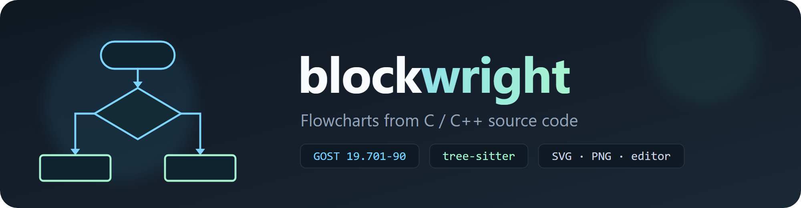
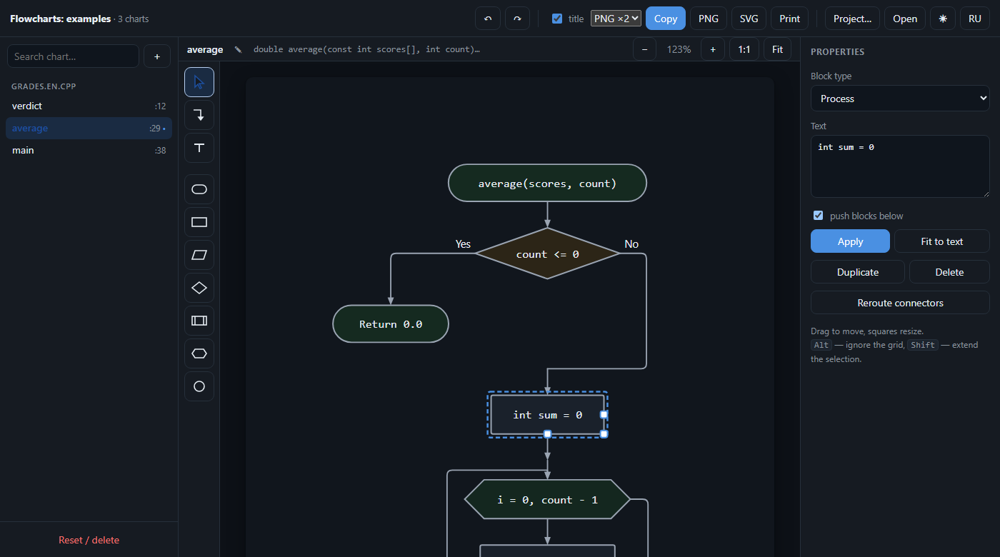
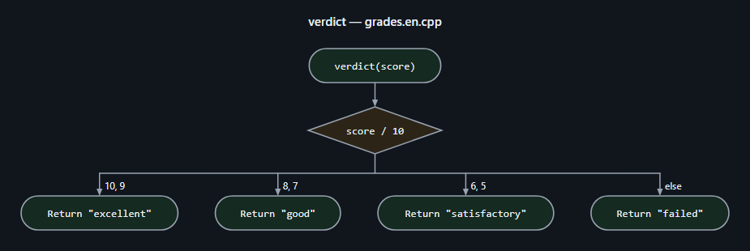
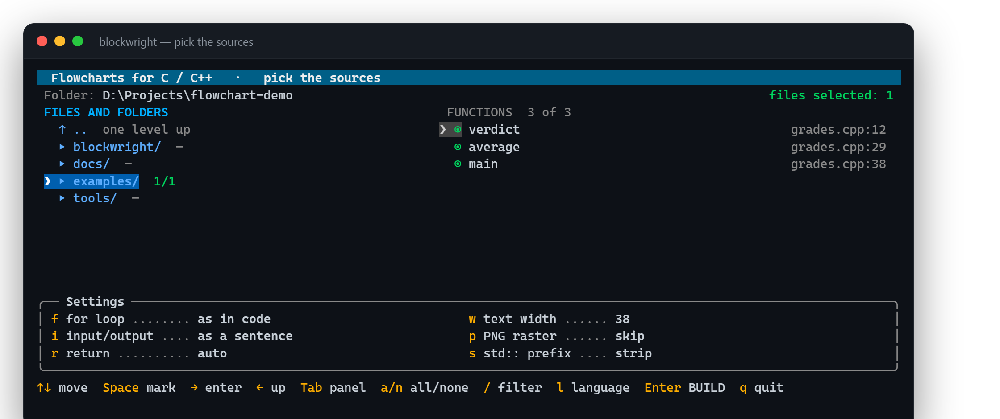
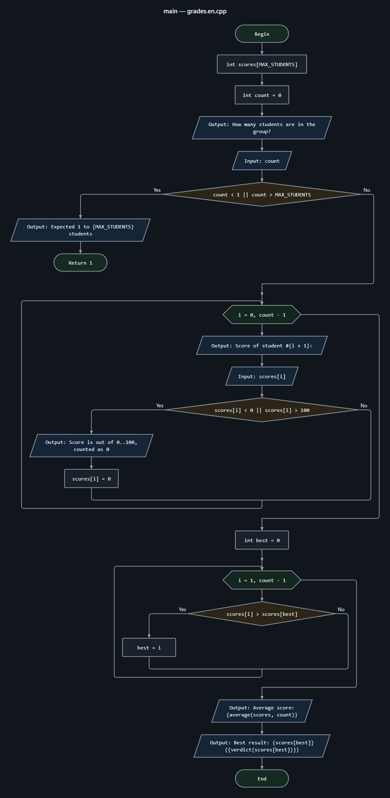

<div align="center">



### Turn C and C++ source code into GOST&nbsp;19.701-90 flowcharts

Vector SVG for your report — and a real diagram editor in the browser.

<p>
  <a href="https://github.com/CodedSplash/blockwright/actions/workflows/ci.yml"></a>
  
  
  
  
  
</p>

**English** · [Русский](README.ru.md)

<a href="#-quick-start">Quick start</a> ·
<a href="#-pick-sources-in-the-terminal">Terminal picker</a> ·
<a href="#-command-line">CLI</a> ·
<a href="#-the-editor">Editor</a> ·
<a href="#-how-code-becomes-a-chart">Block mapping</a> ·
<a href="#-standalone-executable">Binary</a> ·
<a href="#-android">Android</a>

<br>



</div>

---

## ✨ What you get

|  |  |
|---|---|
| 🧠 **Real parsing** | tree-sitter grammars for C and C++: classes, templates, namespaces, overloads, range-`for`, `switch` with fallthrough, `goto`, `try/catch` — never regular expressions |
| 📁 **Whole projects** | directories are walked recursively, the language of each file is detected automatically, and a file that fails one grammar is retried with the other |
| 💬 **Readable blocks** | `cout << "Score #" << i << ": "` becomes `Вывод: Score #{i}:`, and `printf("Total: %d\n", s)` becomes `Вывод: Total: {s}` |
| ✏ **A real editor** | drag blocks, reshape connectors, re-attach arrows, add shapes from a palette, draw a chart from scratch, undo, export |
| 📄 **Report ready** | SVG drops into Word as vector, PNG goes straight to the clipboard, every diagram is captioned `Рисунок N — …` |
| 🎨 **Figma friendly** | arrows are real polygons and shapes sit in named groups, so the file opens as a clean layer tree |
| 🌗 **Light and dark** | one click switches the interface *and* the charts; the theme you see is the theme you export |
| 🌍 **Two languages** | Russian and English throughout — interface, terminal picker and the labels on the charts |
| 🎒 **Portable** | parsers ship with the repository — clone and run, or build a single executable |

> [!NOTE]
> The tool targets **GOST 19.701-90**, the flowchart standard used in Russian
> engineering coursework — but everything it prints can speak English too:
> `--ui-lang en` (or the **RU/EN** button in the editor) switches the interface,
> the terminal picker and the words on the charts.

<div align="center">
  
  <br><sub>A <code>switch</code> turned into a chart — one column per <code>case</code>, captioned and ready for a report</sub>
</div>

---

## 🚀 Quick start

```bash
git clone https://github.com/CodedSplash/blockwright.git
cd blockwright
python -m blockwright examples --open
```

That is all: Python 3.10+ is the only requirement, the parsers are bundled.

| Platform | Launcher |
|----------|----------|
| **Windows** | double-click `blockwright.bat`, or grab [`blockwright.exe`](https://github.com/CodedSplash/blockwright/releases/latest) |
| **Linux / macOS** | `chmod +x blockwright.sh` once, then `./blockwright.sh` |

Everything lands in a `блок-схемы` folder next to the sources:

```
блок-схемы/
├── index.html           album + editor with every diagram
├── grades__main.svg     one file per function
├── grades__verdict.svg
└── grades__average.svg
```

---

## 🖥 Pick sources in the terminal

Run with no arguments and you get a file navigator: `→` enters a folder, `←`
goes up, `Space` marks a file — or a whole folder, recursively (the `1/1` badge
shows how many sources inside are selected). The function list updates as you
move, and any function can be switched off. Mouse and keyboard both work.

<div align="center">
  
</div>

> [!TIP]
> Settings at the bottom toggle with single letters — `f` `i` `r` `w` `p` `s` —
> and are remembered until the next run.

---

## 💻 Command line

```bash
python -m blockwright "Lab 1"                      # one folder
python -m blockwright . -o out --open              # whole tree, open the album
python -m blockwright . --only main --only *Queue* # pick functions by pattern
python -m blockwright . --png 3                    # also render raster at ×3
python -m blockwright . --list                     # just list what was found
```

<details>
<summary><b>All options</b></summary>

<br>

| Option | Meaning |
|--------|---------|
| `-o, --out DIR` | where to write the result |
| `--only PATTERN`, `--exclude PATTERN` | filter functions by name (repeatable) |
| `--lang {auto,c,cpp}` | force the grammar |
| `--for-style {auto,hexagon,decision}` | how `for` loops are drawn |
| `--io-style {pretty,list,code}` | text inside I/O blocks |
| `--return-style {auto,value,end}` | how `return` is labelled |
| `--png [SCALE]` | also save `.png` (default ×2, needs Chrome or Edge) |
| `--theme {light,dark}` | palette for charts and the album |
| `--ui-lang {ru,en}` | language of the interface and chart labels |
| `--keep-std` | keep the `std::` prefix |
| `--width N` | characters per line inside a block (default 38) |
| `--plain-begin` | write “Начало” instead of the function signature |
| `-i, --interactive` | open the picker even when a path is given |
| `--no-ui` | never open the picker (for scripts and CI) |
| `--no-svg`, `--no-html` | skip individual files / the album |
| `--no-recursive` | do not descend into subfolders |
| `--list` | list functions and exit |
| `-q, --quiet` | less output |

</details>

---

## 🎨 The editor

`index.html` is not an image — the model of every diagram is embedded in the
page and the browser redraws it with the same algorithm the Python side uses.

- **Blocks** drag, handles resize them. Connectors stay attached: an endpoint
  travels with its own block, always meets it along the side normal, and never
  tears off the block at the other end.
- **Connectors** reveal their nodes on click — drag them, add new ones, or drop
  an endpoint onto another block to re-attach it. *Reroute* rebuilds the path.
- **Palette**: Select (<kbd>V</kbd>), Connector (<kbd>C</kbd>), Label
  (<kbd>T</kbd>) and the seven GOST block types (<kbd>1</kbd>–<kbd>7</kbd>).
- **Shortcuts**: <kbd>Ctrl</kbd>+<kbd>Z</kbd> / <kbd>Ctrl</kbd>+<kbd>Shift</kbd>+<kbd>Z</kbd>,
  <kbd>Ctrl</kbd>+<kbd>D</kbd>, <kbd>Del</kbd>, arrows to nudge, <kbd>Alt</kbd>
  to ignore the grid, <kbd>Shift</kbd> to extend the selection.
- **＋** starts an empty chart, so you can draw an algorithm that has no code yet;
  the ✎ button (or a double click on the name) renames any chart.
- **Theme and language** switch in the top-right corner and are remembered
  between sessions, together with the **title** checkbox that decides whether
  the exported SVG/PNG carries a heading.
- **Project…** exports every edit and custom chart as one `.json`; **Open**
  loads it back. Edits live in the browser and never touch your files.

---

## 🔤 How code becomes a chart

<details open>
<summary><b>Construct → block</b></summary>

<br>

| Construct | Block |
|-----------|-------|
| function entry | terminator with the signature (`Начало` for `main`) |
| expression, assignment, declaration | process |
| `cout <<`, `cin >>`, `printf`, `scanf`, `getline` | input/output parallelogram |
| call to a function from the same project | predefined process |
| `if / else`, `else if` | decision with `Да` / `Нет` branches |
| `switch` | decision with one column per `case`, fallthrough drawn explicitly |
| counting `for` | preparation hexagon: `i = 0, n - 1` |
| general `for` | init block + decision + step block |
| `for (auto x : v)` | preparation hexagon “для каждого x из v” |
| `while`, `do … while` | decision with a feedback line |
| `break`, `continue` | line to the loop exit / to the condition |
| `return` | terminator `Возврат …` or `Конец` |
| `goto`, label | on-page connector |
| `throw`, `try / catch` | terminator `Исключение: …`, decision for the handler |

</details>

<div align="center">
  
  <br><sub><code>main()</code> from <a href="examples/grades.en.cpp">examples/grades.en.cpp</a></sub>
</div>

---

## 📦 Standalone executable

Every [release](https://github.com/CodedSplash/blockwright/releases/latest)
carries ready binaries built by CI — Python is already inside, just download
and run:

| File | Platform |
|------|----------|
| `blockwright-windows-x64.exe` | Windows 10/11, 64-bit |
| `blockwright-linux-x86_64` | Linux, glibc 2.35+ (Ubuntu 22.04 and newer) |
| `blockwright-linux-aarch64` | ARM64 Linux — Raspberry Pi, ARM servers, `proot-distro` on Android |

Building it yourself takes two commands:

```bash
pip install pyinstaller
python build.py          # -> dist/blockwright[.exe]
```

> [!IMPORTANT]
> A build runs only on the system it was made for, so build on the target
> platform (WSL is enough for a Linux binary). The release workflow does all
> three in parallel on GitHub runners.

---

## 📱 Android

Charts can be built right on a phone through
[Termux](https://termux.dev) — the terminal picker and the browser editor both
work, and the editor is usable with a finger: drag blocks, edit text, export
PNG straight to the gallery.

```bash
pkg install git
git clone https://github.com/CodedSplash/blockwright
sh blockwright/tools/install-termux.sh
```

The script installs Python and clang, **builds the tree-sitter parsers from
source** (there are no prebuilt wheels for Android) and creates a `blockwright`
command. After `termux-setup-storage` the phone's files appear under
`~/storage/shared`, so a project downloaded to the phone can be turned into
charts:

```bash
blockwright ~/storage/shared/Download/lab1
```

> [!TIP]
> Even without Termux an Android phone is enough to *edit* charts: generate
> `index.html` on a computer, copy it over and open it in the browser — the
> whole editor lives inside that single file.

The `blockwright-linux-aarch64` binary from the releases page also runs on
Android inside `proot-distro` (Ubuntu), if you prefer not to compile anything.

---

## 🧱 How it works

Layout is **structural**: every construct places itself and returns a frame with
its entry on top and its exit at the bottom, both on the same vertical spine, so
blocks stack without overlaps. `break` and `continue` escape sideways through
free lanes and are closed by the loop that owns them.

The editor receives the model rather than a picture and renders it with the same
algorithm — the two outputs were diffed and agree to within 0.01 px, so editing a
block in the browser yields exactly the SVG a rebuild would produce.

<details>
<summary><b>Project layout</b></summary>

<br>

```text
blockwright/
├── __main__.py     entry point, activates the bundled parsers
├── parse.py        file discovery, grammar choice, function extraction
├── build.py        syntax tree  →  intermediate representation
├── model.py        IR structures
├── layout.py       structural layout: coordinates of shapes and lines
├── render.py       SVG output and the model handed to the editor
├── album.py        the whole browser album/editor
├── tui.py          terminal picker
├── png.py          raster export via headless Chrome/Edge
└── text.py         text wrapping and measurement
tools/
├── vendor.py             rebuild the bundled parsers
├── install-termux.sh     one-shot setup for Android/Termux
└── screenshot_picker.py  render the picker screenshot for the docs
build.py            single-file build
```

</details>

---

## 🙏 Acknowledgements

Parsing rests on [tree-sitter](https://github.com/tree-sitter/tree-sitter) and
its [C](https://github.com/tree-sitter/tree-sitter-c) and
[C++](https://github.com/tree-sitter/tree-sitter-cpp) grammars.

## 📄 License

[MIT](LICENSE) — see [CHANGELOG.md](CHANGELOG.md) for release notes. The parsers
under `vendor/` belong to the tree-sitter project and are redistributed under the
same license.
