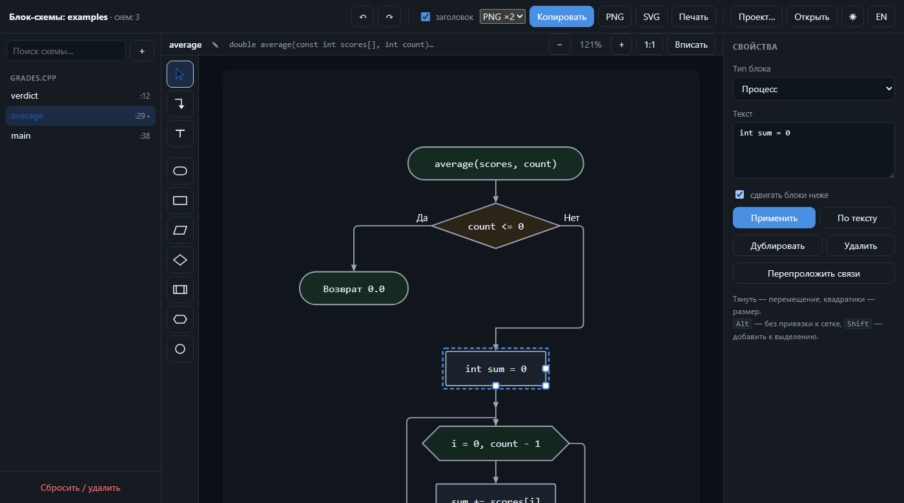
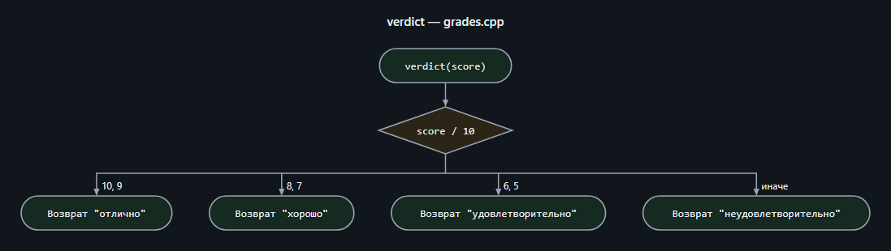
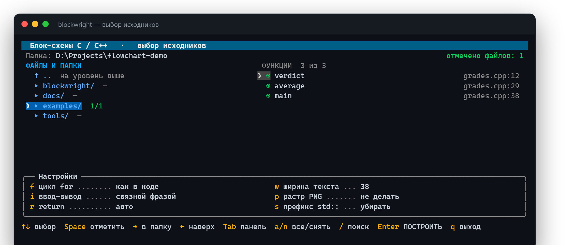
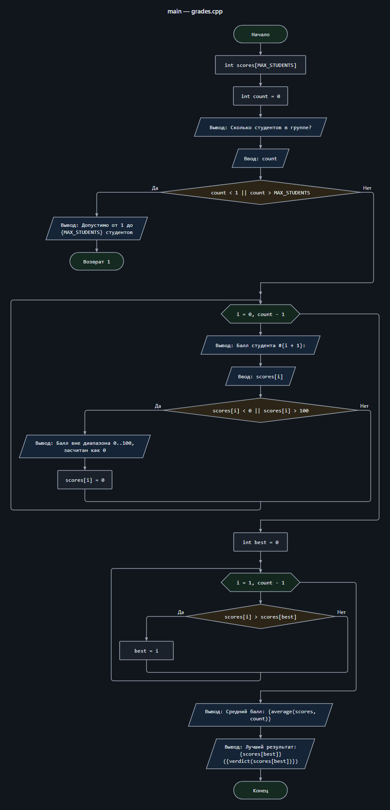

<div align="center">


### Блок-схемы по исходному коду C и C++ в нотации ГОСТ&nbsp;19.701-90

Векторный SVG для отчёта — и настоящий редактор схем прямо в браузере.

<p>
  <a href="https://github.com/CodedSplash/blockwright/actions/workflows/ci.yml"></a>
  
  
  
  
  
</p>

[English](README.md) · **Русский**

<a href="#-быстрый-старт">Быстрый старт</a> ·
<a href="#-выбор-исходников-в-консоли">Выбор в консоли</a> ·
<a href="#-командная-строка">Командная строка</a> ·
<a href="#-редактор">Редактор</a> ·
<a href="#-как-код-превращается-в-схему">Соответствие блоков</a> ·
<a href="#-отдельный-исполняемый-файл">Сборка</a>

<br>



</div>

---

## ✨ Что умеет

|  |  |
|---|---|
| 🧠 **Понимает язык** | грамматики tree-sitter для C и C++: классы, шаблоны, пространства имён, перегрузки, `for` по диапазону, `switch` с «проваливанием», `goto`, `try/catch` — никаких регулярных выражений |
| 📁 **Целые проекты** | папки обходятся рекурсивно, язык каждого файла определяется сам, а файл, не поддавшийся одной грамматике, пробуется второй |
| 💬 **Читаемый текст** | `cout << "Балл #" << i << ": "` превращается в `Вывод: Балл #{i}:`, а `printf("Сумма: %d\n", s)` — в `Вывод: Сумма: {s}` |
| ✏️ **Настоящий редактор** | перетаскивание блоков, правка узлов линий, перепривязка стрелок, палитра фигур, схемы с нуля, отмена, экспорт |
| 📄 **Готово для отчёта** | SVG вставляется в Word как вектор, PNG копируется в буфер, каждая схема подписана `Рисунок N — …` |
| 🎨 **Дружит с Figma** | стрелки — настоящие фигуры, блоки разложены по именованным группам, файл открывается аккуратным деревом слоёв |
| 🎒 **Переносимость** | парсеры лежат в репозитории: клонировал и запустил — или собери один исполняемый файл |

> [!NOTE]
> Подписи на схемах и интерфейс — на русском: утилита следует ГОСТ 19.701-90.

<div align="center">
  
  <br><sub><code>switch</code> на схеме — по колонке на каждый <code>case</code>, с подписью под рисунком</sub>
</div>

---

## 🚀 Быстрый старт

```bash
git clone https://github.com/CodedSplash/blockwright.git
cd blockwright
python -m blockwright examples --open
```

Это всё: нужен только Python 3.10 или новее, парсеры уже в комплекте.

| Система | Запуск |
|---------|--------|
| **Windows** | двойной щелчок по `blockwright.bat` или готовый [`blockwright.exe`](https://github.com/CodedSplash/blockwright/releases/latest) |
| **Linux / macOS** | один раз `chmod +x blockwright.sh`, дальше `./blockwright.sh` |

Результат складывается в папку `блок-схемы` рядом с исходниками:

```
блок-схемы/
├── index.html           альбом-редактор со всеми схемами
├── grades__main.svg     по одной схеме на функцию
├── grades__verdict.svg
└── grades__average.svg
```

---

## 🖥 Выбор исходников в консоли

Запуск без аргументов открывает файловый навигатор: `→` входит в папку, `←`
поднимается наверх, `Space` отмечает файл — или всю папку рекурсивно (значок
`1/1` показывает, сколько исходников внутри отмечено). Список функций
пересчитывается на лету, любую можно выключить. Работают и мышь, и клавиатура.

<div align="center">
  
</div>

> [!TIP]
> Настройки внизу переключаются одной буквой — `f` `i` `r` `w` `p` `s` — и
> запоминаются до следующего запуска.

---

## ⌨️ Командная строка

```bash
python -m blockwright "Лабораторная работа №1"     # одна папка
python -m blockwright . -o out --open              # всё дерево, открыть альбом
python -m blockwright . --only main --only *Queue* # отобрать функции
python -m blockwright . --png 3                    # ещё и растр ×3
python -m blockwright . --list                     # что нашлось, без сборки
```

<details>
<summary><b>Все ключи</b></summary>

<br>

| Ключ | Назначение |
|------|------------|
| `-o, --out ПАПКА` | куда складывать результат |
| `--only ШАБЛОН`, `--exclude ШАБЛОН` | отобрать функции по имени (можно повторять) |
| `--lang {auto,c,cpp}` | принудительно задать грамматику |
| `--for-style {auto,hexagon,decision}` | оформление `for` |
| `--io-style {pretty,list,code}` | текст блоков ввода-вывода |
| `--return-style {auto,value,end}` | оформление `return` |
| `--png [МАСШТАБ]` | дополнительно сохранить `.png` (по умолчанию ×2, нужен Chrome или Edge) |
| `--keep-std` | не убирать префикс `std::` |
| `--width N` | длина строки текста в блоке (по умолчанию 38) |
| `--plain-begin` | писать «Начало» вместо сигнатуры функции |
| `-i, --interactive` | открыть выбор, даже если путь указан |
| `--no-ui` | никогда не открывать выбор (для скриптов и CI) |
| `--no-svg`, `--no-html` | не создавать отдельные файлы / альбом |
| `--no-recursive` | не заходить во вложенные папки |
| `--list` | перечислить функции и выйти |
| `-q, --quiet` | меньше сообщений |

</details>

---

## 🎨 Редактор

`index.html` — не картинка: внутрь зашита модель каждой схемы, и браузер рисует
её тем же алгоритмом, что и Python.

- **Блоки** перетаскиваются, ручки меняют размер. Линии привязаны: конец
  переезжает вместе со «своим» блоком, подходит к нему строго по нормали к
  стороне и не отрывается от соседнего.
- **Линии** показывают узлы по щелчку — их можно таскать, добавлять, а крайний
  узел перетащить на другой блок, чтобы перепривязать. «Проложить заново»
  строит маршрут с нуля.
- **Палитра**: Выбор (<kbd>V</kbd>), Связь (<kbd>C</kbd>), Подпись
  (<kbd>T</kbd>) и семь типов блоков ГОСТ (<kbd>1</kbd>–<kbd>7</kbd>).
- **Горячие клавиши**: <kbd>Ctrl</kbd>+<kbd>Z</kbd> /
  <kbd>Ctrl</kbd>+<kbd>Shift</kbd>+<kbd>Z</kbd>, <kbd>Ctrl</kbd>+<kbd>D</kbd>,
  <kbd>Del</kbd>, стрелки — сдвиг, <kbd>Alt</kbd> — без привязки к сетке,
  <kbd>Shift</kbd> — добавить к выделению.
- **＋** создаёт пустую схему: алгоритм можно нарисовать и без кода.
- **Проект…** выгружает все правки и свои схемы одним `.json`, **Открыть** —
  загружает обратно. Правки живут в браузере и исходные файлы не трогают.

---

## 🔤 Как код превращается в схему

<details open>
<summary><b>Конструкция → блок</b></summary>

<br>

| Конструкция | Блок |
|-------------|------|
| начало функции | овал с сигнатурой (для `main` — «Начало») |
| выражение, присваивание, объявление | процесс |
| `cout <<`, `cin >>`, `printf`, `scanf`, `getline` | параллелограмм ввода-вывода |
| вызов функции из этого же проекта | предопределённый процесс |
| `if / else`, `else if` | ромб с ветвями «Да» / «Нет» |
| `switch` | ромб с колонкой на каждый `case`, «проваливание» рисуется явно |
| `for` со счётчиком | шестиугольник «подготовка»: `i = 0, n - 1` |
| `for` общего вида | инициализация + ромб условия + модификация |
| `for (auto x : v)` | шестиугольник «для каждого x из v» |
| `while`, `do … while` | ромб условия с обратной связью |
| `break`, `continue` | линия к выходу из цикла / к проверке условия |
| `return` | овал «Возврат …» либо «Конец» |
| `goto`, метка | круг-соединитель |
| `throw`, `try / catch` | овал «Исключение: …», ромб для обработчика |

</details>

<div align="center">
  
  <br><sub><code>main()</code> из <a href="examples/grades.cpp">examples/grades.cpp</a></sub>
</div>

---

## 📦 Отдельный исполняемый файл

```bash
pip install pyinstaller
python build.py
```

Получится `dist/blockwright.exe` (Windows, ~9 МБ) или `dist/blockwright`
(Linux) — с Python и парсерами внутри, копируется куда угодно.

> [!IMPORTANT]
> Собирать нужно на той системе, для которой делается сборка: `.exe` — в
> Windows, бинарник Linux — в Linux (подойдёт и WSL). Готовая сборка для
> Windows приложена к каждому
> [релизу](https://github.com/CodedSplash/blockwright/releases/latest).

---

## 🧱 Как это устроено

Разметка **структурная**: каждая конструкция сама размещает себя и возвращает
рамку со входом сверху и выходом снизу на одной вертикальной оси, поэтому блоки
стыкуются без пересечений. Переходы `break` и `continue` выводятся наружу по
свободным боковым дорожкам и замыкаются тем циклом, которому принадлежат.

Редактор получает не картинку, а модель схемы и рисует её тем же алгоритмом —
расхождение с Python проверено и не превышает 0,01 px, так что правка блока в
браузере даёт ровно такой же SVG, как пересборка.

<details>
<summary><b>Состав проекта</b></summary>

<br>

```text
blockwright/
├── __main__.py     точка входа, подключение парсеров из vendor
├── parse.py        поиск файлов, выбор грамматики, извлечение функций
├── build.py        синтаксическое дерево  →  внутреннее представление
├── model.py        структуры представления
├── layout.py       структурная разметка: координаты фигур и линий
├── render.py       отрисовка SVG и модель для редактора
├── album.py        альбом-редактор index.html целиком
├── tui.py          выбор исходников в консоли
├── png.py          растеризация через headless Chrome/Edge
└── text.py         перенос и измерение текста
tools/
├── vendor.py             пересборка папки с парсерами
└── screenshot_picker.py  скриншот консольного выбора для документации
build.py            сборка одного исполняемого файла
```

</details>

---

## 🙏 Благодарности

Разбор кода держится на [tree-sitter](https://github.com/tree-sitter/tree-sitter)
и грамматиках [C](https://github.com/tree-sitter/tree-sitter-c) и
[C++](https://github.com/tree-sitter/tree-sitter-cpp).

## 📄 Лицензия

[MIT](LICENSE) — историю выпусков см. в [CHANGELOG.md](CHANGELOG.md). Парсеры в
`vendor/` принадлежат проекту tree-sitter и распространяются по той же лицензии.
